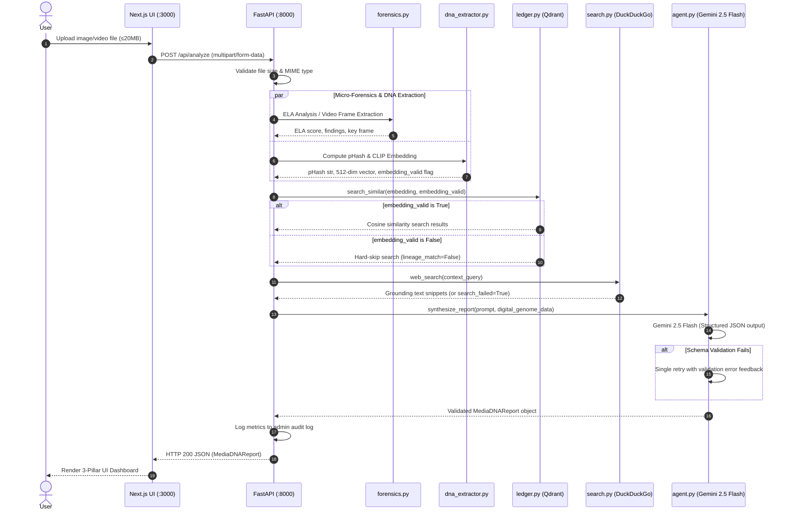

# TruthDNA Architecture & System Design

## 1. Executive Summary & Core Philosophy

**TruthDNA** is an enterprise-grade forensic media analysis platform designed to evaluate images and videos for manipulation, synthetic origin, and context reuse. 

### The Golden Rule
> **TruthDNA NEVER outputs a binary TRUE/FALSE, REAL/FAKE, or AUTHENTIC/SYNTHETIC verdict.**

Binary verdicts in media forensics are scientifically flawed and misleading due to re-encoding artifacts, compression noise, social media re-sampling, and context shifts. Instead, TruthDNA strictly enforces a **3-Pillar Diagnostic Model**:

1. **Evidence (Forensic Signals)** — Concrete, empirical observations across multiple analytical dimensions (ELA compression variance, pHash similarity, metadata, reverse search context).
2. **Confidence (Granular Scores)** — Multi-dimensional scores ($0.0 \rightarrow 1.0$) across specific analytical facets (e.g., `visual_integrity`, `metadata_coherence`, `semantic_grounding`, `lineage_confidence`), backed by mandatory LLM chain-of-thought weighting rationale.
3. **Uncertainty (Explicit Limitations)** — Mandatory listing of known unknowns, unassessed modalities, model fallbacks, and potential false-positive causes.

---

## 2. High-Level System Architecture

```mermaid
graph TD
    User["Client Browser (User UI)"] -->|Multipart Upload ≤20MB| NextFS["Next.js 15 Frontend<br/>(React 19 / TypeScript)"]
    NextFS -->|POST /api/analyze| FastAPI["FastAPI Orchestrator<br/>(backend/main.py)"]

    subgraph Backend Core Pipeline
        FastAPI -->|1. File Validation| Val["Size & MIME Filter"]
        Val -->|2. Micro-Forensics| ELA["Forensics Engine<br/>(backend/forensics.py)<br/>• Image/Video ELA<br/>• Frame Extractor (15s cap)"]
        Val -->|3. DNA Extraction| DNA["Digital DNA Extractor<br/>(backend/dna_extractor.py)<br/>• pHash computation<br/>• CLIP 512-dim Embedding"]
        DNA -->|4. Vector Search| Qdrant["In-Memory Qdrant Ledger<br/>(backend/ledger.py)<br/>• Cosine Similarity (Threshold 0.85)<br/>• Hard-Skip if Zero-Vector"]
        Val -->|5. Web Grounding| DDG["Grounding Engine<br/>(backend/search.py)<br/>• DuckDuckGo Search<br/>• Reverse Context Query"]
        
        ELA -->|Forensic Data| LLM["Gemini Synthesis Engine<br/>(backend/agent.py)<br/>• Gemini 2.5 Flash<br/>• Pydantic V2 Schema Validation"]
        DNA -->|Genome Fingerprint| LLM
        Qdrant -->|Lineage Matches| LLM
        DDG -->|Grounding Results| LLM
    end

    LLM -->|Strict MediaDNAReport JSON| FastAPI
    FastAPI -->|JSON Response| NextFS
    NextFS -->|Render 3-Pillar UI| User

    subgraph Administrative Layer
        FastAPI Router --- AdminAPI["Admin Diagnostics Router<br/>(backend/admin.py)<br/>• /api/admin/stats<br/>• /api/admin/ledger/records<br/>• /api/admin/log"]
    end
```

---

## 3. Core Architectural Modules

### 3.1 Frontend (`frontend/src/app/`)
* **Technology Stack**: Next.js 15 (App Router), React 19, TypeScript, Tailwind CSS.
* **Main Entrypoint**: [`frontend/src/app/page.tsx`](file:///c:/Users/DELL/.gemini/antigravity/scratch/LuminaLens/truthdna/frontend/src/app/page.tsx)
* **Key Responsibilities**:
  * Drag-and-drop file upload interface with interactive validation (20MB limit).
  * Real-time multi-stage analysis progress animation.
  * 3-Pillar Diagnostic UI Display:
    * **Digital Genome Card**: Displays visual pHash, semantic vector presence, and acoustic status.
    * **Evidence Pillar**: Categorized forensic signals (`Clean`, `Suspicious`, `Altered`) with timeline markers and source links.
    * **Confidence Pillar**: Multi-radial/bar indicators for granular scores + LLM weighting rationale box.
    * **Uncertainty Pillar**: Alert cards detailing fallbacks, blind spots, and false-positive warnings.
    * **Shareable Context Card**: Compact non-verdict summary snippet.

### 3.2 Backend Orchestrator (`backend/main.py`)
* **Technology Stack**: FastAPI, Uvicorn, Python 3.10+.
* **Entrypoint**: [`backend/main.py`](file:///c:/Users/DELL/.gemini/antigravity/scratch/LuminaLens/truthdna/backend/main.py)
* **Key Responsibilities**:
  * Environment & API key validation (`GEMINI_API_KEY`) on startup.
  * Triggers auto-seeding of the vector ledger via [`backend/seed_ledger.py`](file:///c:/Users/DELL/.gemini/antigravity/scratch/LuminaLens/truthdna/backend/seed_ledger.py).
  * Executes the sequential forensic pipeline: File Validation $\rightarrow$ ELA $\rightarrow$ DNA Extraction $\rightarrow$ Ledger Search $\rightarrow$ Web Search $\rightarrow$ Synthesis.
  * Records analysis metrics into the in-memory audit log.

### 3.3 Micro-Forensics Engine (`backend/forensics.py`)
* **Key Functions**:
  * `compute_ela_score_for_image_file(raw_bytes)`: Performs Error Level Analysis by re-compressing the image at quality scale (default 95), calculating normalized absolute pixel differences, and returning an ELA error variance score ($0.0 \rightarrow 1.0$).
  * `extract_frames(video_path)`: OpenCV frame extractor capped at a maximum of 15 seconds at 1 fps (max 15 keyframes) to prevent buffer overflows and latency spikes.
  * `compute_ela_score_for_video_frames(frames)`: Computes average ELA across extracted video keyframes.

### 3.4 Digital DNA Extractor (`backend/dna_extractor.py`)
* **Key Functions**:
  * `compute_phash(image_bytes)`: Calculates a 64-bit perceptual hash using `imagehash.phash()` for visual near-duplicate matching.
  * `extract_clip_embedding(image_bytes)`: Generates a 512-dimensional semantic vector using HuggingFace `openai/clip-vit-base-patch32`. L2-normalized for cosine similarity.
  * **Zero-Vector Sentinel Contract**: If CLIP loading or inference fails (OOM, missing package, network timeout), returns `([0.0]*512, embedding_valid=False)`.

### 3.5 Vector Ledger & Lineage (`backend/ledger.py` & `backend/seed_ledger.py`)
* **Technology**: Qdrant In-Memory client (`:memory:` mode).
* **Key Functions**:
  * `search_similar(embedding, embedding_valid)`: Searches the `truthdna_lineage` collection using cosine similarity.
  * **Hard-Skip Contract**: If `embedding_valid` is `False`, the search is skipped immediately, returning `lineage_match_found = False` and preventing false-positive matches against zero-vectors.
  * Auto-seeded on every backend startup with baseline historical reference records (e.g., historical flood and earthquake media).

### 3.6 Web Grounding Engine (`backend/search.py`)
* **Technology**: DuckDuckGo Search API (`duckduckgo_search`).
* **Key Functions**:
  * `web_search(query)`: Searches web records for contextual grounding, reverse image query clues, and press coverage.
  * Safe fallback wrapper: Returns `search_failed=True` on timeout or rate-limit without breaking the analysis pipeline.

### 3.7 Gemini Synthesis Engine (`backend/agent.py`)
* **Technology**: Google GenAI SDK (`google-genai`), Gemini 2.5 Flash (`gemini-2.5-flash`).
* **Key Functions**:
  * `build_analysis_prompt(...)`: Constructs a comprehensive forensic payload containing all raw observations, ELA scores, pHash values, vector match statuses, web search snippets, and fallback notices.
  * `synthesize_report(...)`: Invokes Gemini 2.5 Flash using structured `response_schema=MediaDNAReport`.
  * **Single Retry Loop**: If Gemini output violates Pydantic schema validation, feeds the exact error back to Gemini for a single retry attempt.

### 3.8 Admin Diagnostics (`backend/admin.py`)
* **Endpoints**:
  * `GET /api/admin/stats`: System uptime, CLIP model load status, Qdrant collection state, aggregate analysis statistics.
  * `GET /api/admin/ledger/records`: Direct inspection of historical Qdrant records.
  * `GET /api/admin/log`: Last 50 analysis activity records with duration and fallback status.

---

## 4. End-to-End Execution Sequence



---

## 5. Strict Safety Contracts & Fallback Guarantee Table

| Subsystem | Failure Scenario | Fallback Action | Impact on Report |
| :--- | :--- | :--- | :--- |
| **Environment** | Missing `GEMINI_API_KEY` | `sys.exit(1)` at startup | Application refuses to start with missing key. |
| **File Upload** | File > 20MB or unsupported MIME | HTTP 413 / HTTP 415 exception | Graceful client error message; pipeline aborted. |
| **CLIP Extractor** | Model load timeout, OOM, or missing dependency | Returns `[0.0]*512` sentinel & `embedding_valid=False` | `semantic_vector` marked `null` in Digital Genome; note added to `explicit_uncertainties`. |
| **Vector Ledger** | `embedding_valid=False` | `search_similar()` hard-skips Qdrant search | Prevents false-positive vector matches against zero-vectors. |
| **Web Search** | DuckDuckGo timeout / rate-limit | Returns `[]` & `search_failed=True` | Note added to `explicit_uncertainties`; pipeline continues. |
| **Video Extractor** | Corrupted video or >15s length | Frame extraction capped at 15s @ 1fps | Pipeline operates on available frames; notice included in report. |
| **LLM Synthesis** | JSON Schema mismatch from Gemini | Single automated retry prompt with error diff | Guarantees final output matches `MediaDNAReport` contract. |

---

## 6. API Interface Contracts

### Primary Endpoint
* **`POST /api/analyze`**
  * **Payload**: `multipart/form-data` with key `file` (Max 20MB).
  * **Response**: `MediaDNAReport` (Pydantic V2 JSON).

### Diagnostic & Health Endpoints
* **`GET /health`**: General liveness check and ledger connectivity status.
* **`GET /api/admin/stats`**: Full system metrics and diagnostic breakdown.
* **`GET /api/admin/ledger/records`**: Inspection of active vector ledger entries.
* **`GET /api/admin/log`**: Historical audit log of completed analyses.
* **`GET /docs`**: Interactive FastAPI Swagger documentation.
