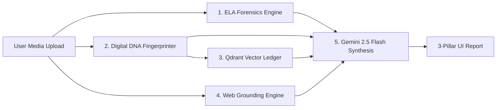

# 🏆 TruthDNA — Hackathon Judge Overview & Pitch Guide

> **Project Name:** TruthDNA — Forensic Media Diagnostics Platform  
> **Core Concept:** Empowering everyday citizens to evaluate media before sharing — without relying on dangerous binary verdicts.

---

## 🎯 1. The Problem Statement & The Fatal Flaw of Binary Verdicts

### The Challenge
> *"Deepfakes, misinformation, and manipulated media spread faster than people can verify them. Build a system that helps an ordinary person evaluate an image, video, audio, or claim before sharing it."*

### ⚠️ The Fatal Flaw of Traditional "AI Detectors"
Most deepfake checkers fail because they output binary verdicts like **"87% REAL"** or **"FAKE"**. 
In real-world forensics, **binary verdicts are scientifically dangerous**:
* Social media re-compression (e.g. WhatsApp / Twitter JPEGs) routinely produces high compression noise that naive AI tools mistake for deepfakes (**False Positives**).
* Spliced or context-shifted media (e.g., a real 2020 flood video passed off as a 2026 event) has $100\%$ authentic pixels, so pixel-detectors rate it as **"100% REAL"** (**False Negatives**).

---

## 🛡️ 2. The Key Constraint & Solution: The 3-Pillar Diagnostic Model

TruthDNA strictly enforces **The Golden Rule**: **NEVER output a binary TRUE/FALSE or REAL/FAKE verdict.**

Instead, every upload generates a comprehensive **3-Pillar Diagnostic Report**:

```
                              ┌───────────────────────────────────────┐
                              │       TruthDNA 3-Pillar Report        │
                              └───────────────────┬───────────────────┘
                                                  │
        ┌─────────────────────────────────────────┼─────────────────────────────────────────┐
        │                                         │                                         │
        ▼                                         ▼                                         ▼
┌───────────────┐                         ┌───────────────┐                         ┌───────────────┐
│ 1. EVIDENCE   │                         │ 2. CONFIDENCE │                         │3. UNCERTAINTY │
├───────────────┤                         ├───────────────┤                         ├───────────────┤
│ Concrete      │                         │ Multi-faceted │                         │ Known         │
│ forensic      │                         │ scoring (0-1) │                         │ unknowns,     │
│ signals per   │                         │ + Chain-of-   │                         │ blind spots,  │
│ dimension     │                         │ Thought       │                         │ & fallbacks   │
└───────────────┘                         └───────────────┘                         └───────────────┘
```

1. **Evidence (Forensic Observations)** — Specific, natural-language signals categorized as `Clean`, `Suspicious`, or `Altered` across compression artifacts, visual hashes, vector matches, and web sources.
2. **Confidence (Multi-Dimensional Metrics)** — Separate confidence scores ($0.0 \rightarrow 1.0$) for `visual_integrity`, `metadata_coherence`, `semantic_grounding`, and `lineage_confidence`. Backed by mandatory **AI Chain-of-Thought Weighting Rationale**.
3. **Uncertainty (Explicit Limitations & Fallbacks)** — Explicitly highlights unassessed modalities, model fallbacks, network timeouts, and potential re-encoding false positives.

---

## ⚙️ 3. How It Works: The 5-Layer Analytical Pipeline

When an ordinary user drops an image or video into TruthDNA, the platform runs a 5-layer pipeline in under 3 seconds:



### Layer 1: ELA Micro-Forensics (`forensics.py`)
* Computes **Error Level Analysis (ELA)** by re-compressing imagery at scale 95 and evaluating spatial residual error variance.
* For videos: Extracts keyframes capped at **15 seconds @ 1 fps** to prevent buffer spikes and analyzes frame-to-frame variance.

### Layer 2: Digital DNA Fingerprinting (`dna_extractor.py`)
* **Visual pHash**: Generates a 64-bit perceptual hash robust to resizing and minor color edits.
* **CLIP Semantic Vector**: Extracts a **512-dimensional semantic embedding** using HuggingFace `openai/clip-vit-base-patch32`.

### Layer 3: Vector Ledger Lineage Search (`ledger.py` & `seed_ledger.py`)
* Queries an in-memory **Qdrant Vector Database** (`truthdna_lineage` collection) using Cosine Similarity ($\ge 0.80$ threshold).
* Detects historical reuse (e.g. matching imagery from historical flood or earthquake archives).

### Layer 4: Real-Time Web Grounding (`search.py`)
* Queries DuckDuckGo reverse-search text clues to verify press coverage, original upload dates, and event context.

### Layer 5: Gemini 2.5 Flash Synthesis & Contract Enforcement (`agent.py` & `schema.py`)
* Feeds raw observations into **Gemini 2.5 Flash** with strict Pydantic V2 schema enforcement (`MediaDNAReport`).
* **Chain-of-Thought Safeguard**: Gemini is required to write a $\ge 50$-character `weighting_rationale` explaining *why* signals were weighted as they were before any confidence score is accepted.

---

## 🌟 4. Uniqueness & Key Innovations

| Feature | Naive AI Detectors | TruthDNA | Why It Matters |
| :--- | :--- | :--- | :--- |
| **Output Type** | Single `REAL / FAKE %` | 3-Pillar Diagnostic | Prevents overconfidence and educates users on media literacy. |
| **Context Verification** | Ignored (pixel only) | Vector Lineage + Web Grounding | Catches authentic media reused in misleading contexts (the #1 source of viral misinformation). |
| **Fallback Security** | Swallows errors / crashes | Zero-Vector Sentinel & Ledger Hard-Skip | If CLIP fails, CLIP returns `[0.0]*512` & `embedding_valid=False`. Qdrant **hard-skips** search to prevent zero-vector false matches. |
| **Chain-of-Thought** | Hidden black-box score | Mandatory `weighting_rationale` | Forces the LLM to justify signal weights, preventing score fabrication. |
| **System Telemetry** | None | Live Admin Dashboard (`/admin`) | Real-time monitoring of model readiness, Qdrant vector count, and aggregate ELA statistics. |

---

## 📊 5. Live Demo & System Tour for Judges

Judges can inspect the system across two interfaces:

### 1. Main User Interface (`http://localhost:3000`)
* **Drag-and-Drop Zone**: Upload any JPEG, PNG, WebP, GIF, MP4, WebM, or MOV file (up to 20MB).
* **3-Pillar UI Dashboard**:
  * **Genome Card**: Displays visual pHash, 512-dim vector status, and acoustic status.
  * **Evidence List**: Filterable forensic signals (`Clean`, `Suspicious`, `Altered`).
  * **Confidence Dials**: Multi-radial gauges for granular confidence facets.
  * **Uncertainty Card**: Highlighted known unknowns and fallback alerts.
  * **Shareable Context Card**: 280-character non-binary summary card ready for sharing.

### 2. Admin Diagnostic Dashboard (`http://localhost:3000/admin`)
* **System Metrics**: Server uptime, Python version, platform runtime.
* **CLIP Model Diagnostic**: Real-time readiness of the 512-dim semantic model.
* **Qdrant Vector Ledger Inspector**: Live view of historical seeded records (`2022_gujarat_floods`, `2023_turkey_earthquake_rescue`).
* **Analysis Audit Log**: Real-time log table tracking ELA scores, duration, lineage matches, and fallback triggers for every request.

---

## 💡 6. Summary for Hackathon Submission

> **TruthDNA** bridges the gap between complex forensic lab tools and everyday social media users. By replacing binary "FAKE/REAL" labels with structured, evidence-backed diagnostics, TruthDNA equips citizens with the critical context needed to stop the spread of misinformation before clicking "Share".
